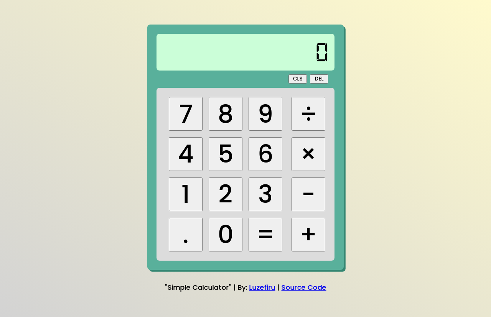

# odin-calculator
A simple interactive calculator inside the web browser to demonstrate the skills I learned form The Odin Project's Foundations Course.

I used this project as a milestone to check whether my foundations of CSS Flexbox, JavaScript DOM Manipulation, and HTML Structuring were reliable and effective in making interactive websites. I am quite happy with the outcome despite having quite messy JavaScript logic because of catching multiple bugs & fixing them.

I don't panic whenever I see the webpage spazz out every time I mistakenly edit the CSS badly. I instinctively ``CTRL+SHIFT+C`` to rely on the Web Browser's Developer Tools to aid my search for that one ``margin: 1rem`` I forgot to remove during layout testing.

I also tried using fonts that are *not* from Google Font's font embed generator and instead used a local ``.woff`` file to import a ``font-family`` instead.

I need to improve on:
- practicing orthogonality with my functions and avoid tightly coupled functions to improve debugging.
- do test-driven-development and not rely on my guts to do my bug tests
- my CSS design/layouting skills by partaking in [Frontend Mentor](https://www.frontendmentor.io/) challenges

# Output
### [Visit the Website Here](https://luzefiru.github.io/odin-calculator/)

# Requirements
These were the requirements in The Odin Project's [Project: Calculator](https://www.theodinproject.com/lessons/foundations-calculator) site to serve as a guide for functionality. Other aesthetic choices and implementations solely depend on the programmer.
